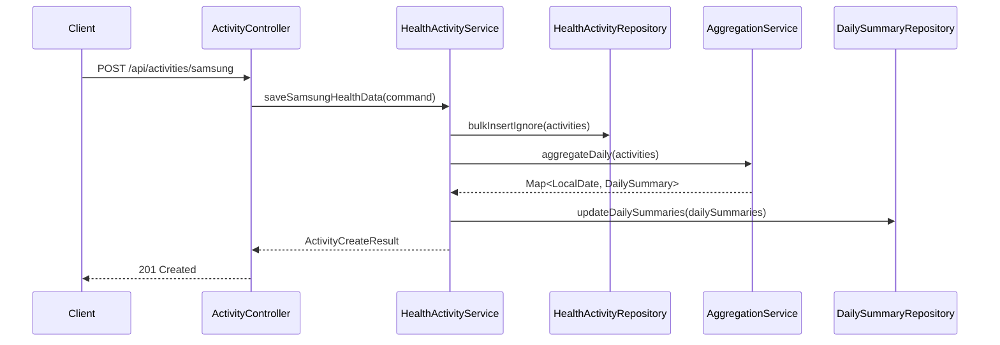
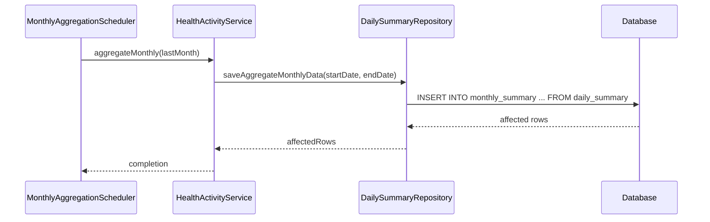
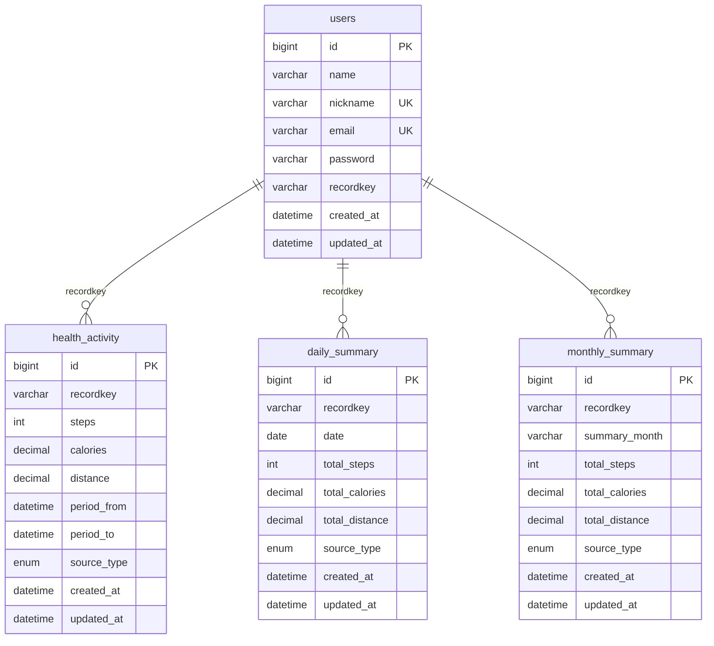

# KB Healthcare Assignment

## 기술 스택

### Backend
- **Java**: 17
- **Spring Boot**: 3.5.10
- **Spring Data JPA**
- **Spring Security** (암호화만)

### Database
- **MySQL**: 8.0

## 실행 방법

### 데이터베이스 설정

```bash
# Docker Compose로 MySQL 실행
docker-compose up -d

# 데이터베이스 정보
# Host: localhost:3306
# Database: kbhealthcare
# Username: kbhealthcare
# Password: kbhealthcare
```

### 애플리케이션 실행

```bash
# 빌드
./gradlew build

# 실행
./gradlew bootRun
```

## API 엔드포인트 명세

### 헬스 데이터 API

#### 삼성 헬스 데이터 저장
```http
POST /api/activities/samsung
Content-Type: application/json

{
  "recordkey": "user123",
  "data": {
    "entries": [
      {
        "period": {
          "from": "2024-11-15 00:00:00",
          "to": "2024-11-15 00:10:00"
        },
        "distance": {"unit": "km", "value": 0.04223},
        "calories": {"unit": "kcal", "value": 2.03},
        "steps": 54
      }
    ],
    "source": {
      "mode": 1,
      "product": {"name": "Galaxy Watch", "vender": "Samsung"},
      "name": "Samsung Health",
      "type": "health"
    }
  },
  "lastUpdate": "2024-11-15T00:10:00+09:00",
  "type": "health"
}
```

#### 애플 헬스 데이터 저장
```http
POST /api/activities/apple
Content-Type: application/json

{
  "recordkey": "user123",
  "data": {
    "memo": "Apple Watch 데이터",
    "entries": [
      {
        "steps": "54",
        "period": {
          "to": "2024-11-15T00:10:00+09:00",
          "from": "2024-11-15T00:00:00+09:00"
        },
        "distance": {"value": 0.04223, "unit": "km"},
        "calories": {"value": 2.03, "unit": "kcal"}
      }
    ],
    "source": {
      "product": {"name": "Apple Watch", "vender": "Apple"},
      "type": "health",
      "mode": 1,
      "name": "Apple Health"
    }
  },
  "type": "health",
  "lastUpdate": "2024-11-15T00:10:00+09:00"
}
```

#### 일별 집계 조회
```http
localhost:8080/api/activities/daily?recordkey=7836887b-b12a-440f-af0f-851546504b13&fromDate=2024-01-01&toDate=2024-12-31
```

#### 월별 집계 조회
```http
localhost:8080/api/activities/monthly?recordkey=7836887b-b12a-440f-af0f-851546504b13&fromDate=2024-01-01&toDate=2024-12-31
```

### 사용자 API

#### 회원가입
```http
POST /api/users/signup
Content-Type: application/json

{
  "name": "홍길동",
  "nickname": "hong123",
  "email": "hong@example.com",
  "password": "password123"
}
```

#### 로그인
```http
POST /api/users/login
Content-Type: application/json

{
  "email": "hong@example.com",
  "password": "password123"
}
```


## 프로젝트 구조 설명

### 패키지 구조

```
com.kbhealthcare.assignment/
├── domain/                # 도메인 영역
│   ├── activity/           
│   ├── user/ 
│   └── common/                  
│        
├── application/           # 애플리케이션 영역
│   ├── activity/          
│   ├── user/              
│   └── aggregation/       # 집계 서비스
│
├── infrastructure/        # 인프라 영역
│   ├── activity/
│   ├── user/          
│   └── security/          # 암호화 구현체
│             
├── interfaces/            # 인터페이스 영역
│   ├── activity/          
│   └── user/ 
│                          
├── config/                # 설정 영역
│
└── support/               # 공통 지원 영역
```

## 핵심 프로세스 시퀀스 다이어그램

### 헬스 데이터 저장 프로세스 (Activity 데이터 저장, 일별 집계 저장)
(* 원본 데이터 저장은 구현하지 않았지만 필요하다고 생각합니다.)



### 월별 집계 프로세스



### 클래스 다이어그램

```mermaid
classDiagram
    %% Domain Layer
    class User {
        +id: Long
        +name: String
        +nickname: String
        +email: String
        +password: String
    }
    
    class HealthActivity {
        +id: Long
        +recordkey: String
        +steps: Integer
        +calories: BigDecimal
        +distance: BigDecimal
        +periodFrom: LocalDateTime
        +periodTo: LocalDateTime
        +sourceType: SourceType
    }
    
    class DailySummary {
        +id: Long
        +recordkey: String
        +date: LocalDate
        +totalSteps: Integer
        +totalCalories: BigDecimal
        +totalDistance: BigDecimal
        +sourceType: SourceType
    }
    
    class MonthlySummary {
        +id: Long
        +recordkey: String
        +yearMonth: String
        +totalSteps: Integer
        +totalCalories: BigDecimal
        +totalDistance: BigDecimal
        +sourceType: SourceType
    }
    
    class SourceType {
        <<enumeration>>
        SAMSUNG
        APPLE
    }
    
    %% Repository Interfaces
    class UserRepository {
        <<interface>>
        +save(User)
        +findByEmail(String)
        +existsByEmail(String)
        +existsByNickname(String)
    }
    
    class HealthActivityRepository {
        <<interface>>
        +bulkInsertIgnore(List)
        +findByRecordkeyAndDateRange(String, LocalDate, LocalDate)
    }
    
    class DailySummaryRepository {
        <<interface>>
        +upsertDailySummaries(List)
        +findByCondition(DailyCondition)
    }
    
    class MonthlySummaryRepository {
        <<interface>>
        +upsertMonthlySummaries(List)
        +findByCondition(MonthlyCondition)
    }
    
    %% Application Layer
    class UserService {
        -userRepository: UserRepository
        +signup(SignUpRequest)
        +login(LoginRequest)
    }
    
    class HealthActivityService {
        -healthActivityRepository: HealthActivityRepository
        -dailySummaryRepository: DailySummaryRepository
        -monthlySummaryRepository: MonthlySummaryRepository
        -aggregationService: AggregationService
        +saveSamsungHealthData(SamsungHealthCommand)
        +saveAppleHealthData(AppleHealthCommand)
        +aggregateDaily(List)
        +aggregateMonthly()
    }
    
    class AggregationService {
        +aggregateDaily(List)
        +aggregateMonthly(List)
    }
    
    %% Infrastructure Layer
    class UserRepositoryImpl {
        -jpaRepository: UserJpaRepository
    }
    
    class HealthActivityRepositoryImpl {
        -jpaRepository: HealthActivityJpaRepository
        -jdbcTemplate: JdbcTemplate
    }
    
    class DailySummaryRepositoryImpl {
        -jpaRepository: DailySummaryJpaRepository
    }
    
    class MonthlySummaryRepositoryImpl {
        -jpaRepository: MonthlySummaryJpaRepository
    }
    
    %% Relationships
    HealthActivity --> SourceType
    DailySummary --> SourceType
    MonthlySummary --> SourceType
    
    UserService --> UserRepository
    HealthActivityService --> HealthActivityRepository
    HealthActivityService --> DailySummaryRepository
    HealthActivityService --> MonthlySummaryRepository
    HealthActivityService --> AggregationService
    
    UserRepositoryImpl ..|> UserRepository
    HealthActivityRepositoryImpl ..|> HealthActivityRepository
    DailySummaryRepositoryImpl ..|> DailySummaryRepository
    MonthlySummaryRepositoryImpl ..|> MonthlySummaryRepository
```



## 데이터베이스 설계

### ERD



## 데이터 조회 결과 제출
./aggerate 폴더에 csv 파일로 저장